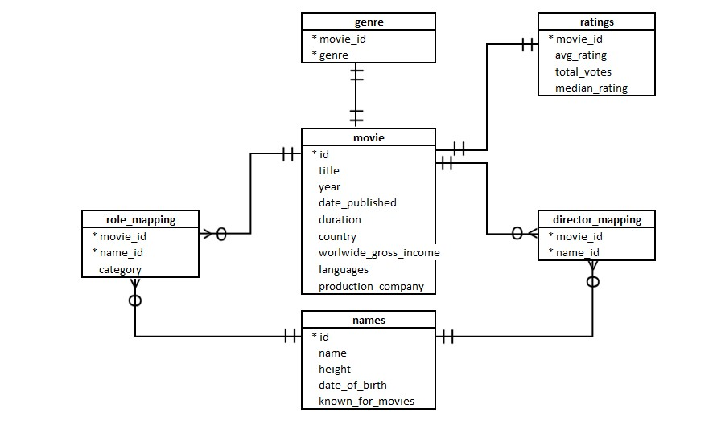

# SQL-PROJECT | RSVP MOVIES DATASET

## Introduction 
RSVP Movies is an Indian film production company which has produced many super-hit movies. They have usually released movies for the Indian audience but for their next project, they are planning to release a movie for the global audience in 2022.

The production company wants to plan their every move analytically based on data and have approached you for help with this new project. You have been provided with the data of the movies that have been released in the past three years. You have to analyse the data set and draw meaningful insights that can help them start their new project.

Here we act as a data analyst and an SQL expert. We have to use SQL to analyse the given data and give recommendations to RSVP Movies based on the insights. 

## Data Model

## Dataset
Here we have 6 tables which are connected to each other with primary key and name of tables are movie, genre, director_mapping, role_mapping, ratings, names.
movie table have columns like id, title, year, date_published, duration, country, worldwide_gross_income, languages, production_company.
  - genre table have columns like movie_id, genre.
  - director_mapping have columns like movie_id, name_id. 
  - role_mapping have columns like movie_id, name_id, category.
  - name have columns like id name, height, date_of_birth, known_for_movies.
  - ratings have columns like movie_id, avg_rating, total_votes, median_rating.

Link of dataset : [Dataset](https://github.com/ASK0805/SQL-Project/tree/main/Dataset)

## Business Problems and Solutions

### Q1. Find the total number of rows in each table of the schema?
        
        SELECT count(*) AS 'number of row in director mapping'
        FROM director_mapping;

        SELECT count(*) AS number_of_rows_genre
        FROM genre;

        SELECT count(*) AS 'number of row movie'
        FROM movie;

        SELECT count(*) AS number_of_row_ratings
        FROM ratings;

        SELECT count(*) AS 'number of row role mapping'
        FROM role_mapping;

### Q2. Which columns in the movie table have null values?
  
    SELECT count(*)
    FROM movie
    WHERE id IS NULL;
  
    SELECT count(*)
    FROM movie
    WHERE title IS NULL;
  
    SELECT count(*)
    FROM movie
    WHERE year IS NULL;
  
    SELECT count(*)
    FROM movie
    WHERE date_published IS NULL;
  
    SELECT count(*)
    FROM movie
    WHERE duration IS NULL;
  
    SELECT count(*)
    FROM movie
    WHERE country IS NULL;
  
    SELECT count(*)
    FROM movie
    WHERE worlwide_gross_income IS NULL;
  
    SELECT count(*)
    FROM movie
    WHERE languages IS NULL;
  
    SELECT count(*)
    FROM movie
    WHERE production_company IS NULL;

### Q3. Find the total number of movies released each year? How does the trend look month wise?

    SELECT 	year, count(id) AS number_of_movies
    FROM movie
    GROUP BY year;

    Second Part of the question 

    SELECT 	month(date_published) AS month_of_movie, count(id) AS number_of_movies
    FROM movie
    GROUP BY month_of_movie
    ORDER BY month_of_movie;

 

